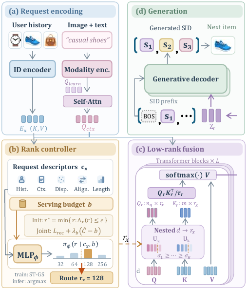

# AdaRank-Rec

Official implementation for ICASSP 2027.



PyTorch implementation of **Request-Adaptive Low-Rank Fusion for Efficient Generative Multimodal Recommendation**.

Implemented: ordered shared Q/K prefixes; fixed-width value aggregation; eight-token context adapter; residual-quantized 4-token SIDs; sufficient-rank labels; budget-conditioned controller; straight-through Gumbel routing; per-budget dual ascent; the paper's 10/3/5 training stages; chronological 5-core Amazon splits; and HR/NDCG@10 candidate scoring utilities.

## Run

Install dependencies and create data. Metadata must contain cached `visual` and `text` arrays keyed by `asin`.

```powershell
pip install -r requirements.txt
python scripts/prepare_amazon.py --reviews reviews_Beauty.json.gz --metadata meta_Beauty.json.gz --output data/beauty.jsonl
python scripts/train.py --data data/beauty.jsonl --sids data/sid_table.json --out checkpoints/beauty.pt
python scripts/sample_candidates.py --data data/beauty.jsonl --num-items 12102 --output data/beauty_test_candidates.pt
python scripts/evaluate.py --data data/beauty.jsonl --sids data/sid_table.json --checkpoint checkpoints/beauty.pt --candidates data/beauty_test_candidates.pt
pytest -q
```

The default configuration is the paper configuration: `d=256`, 8 queries, ranks `{32,64,128,256}`, epsilon `.01`, budgets `{.35,.47,.60}`, effective batch size 32, AdamW `1e-4`, and stage lengths 10/3/5.

For the reported frozen Qwen2-VL-7B-Instruct path, create a `FrozenHFDecoder` from `adarank_rec.decoder` with the model and fixed prompt token IDs, then pass it as `decoder=` to `AdaRankRec`. The decoder remains frozen while dedicated SID input/output parameters are trained, with the fixed eight-token context interface.
